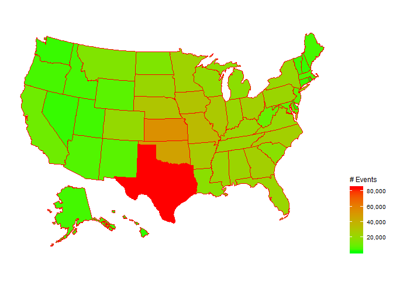
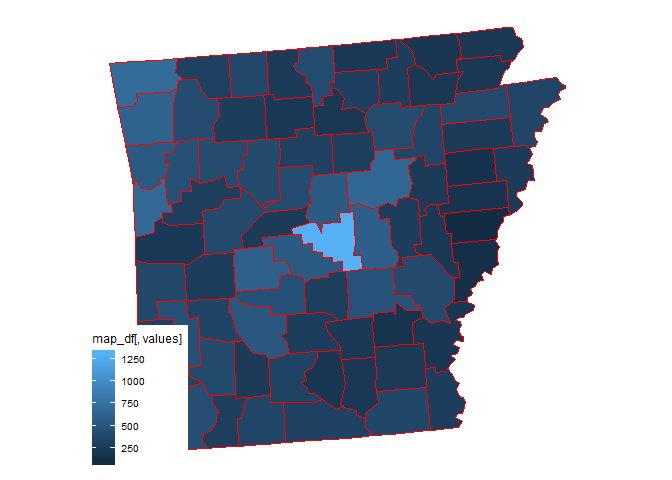
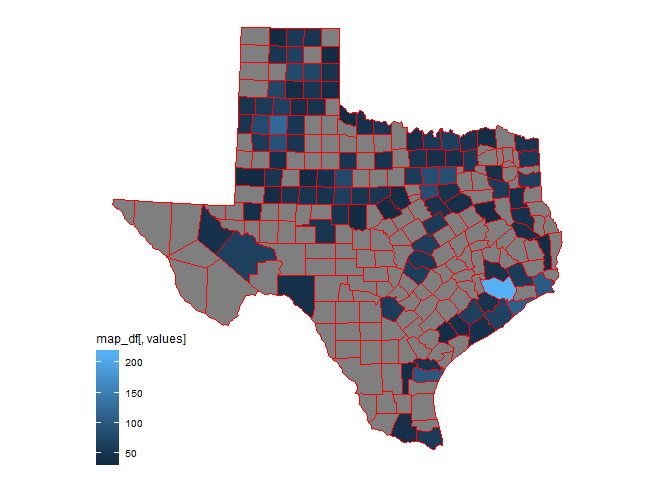

## Synopsis

This file contains my Exploratory Analysis for the second peer reviewed project.

## Exploratory Analysis

### Read in dataset


```r
bz <- bzfile("repdata_data_StormData.csv.bz2", "r")
data <- read.csv(bz)
close(bz)
```

### Take a first look at dataset


```r
dim(data)       ## 902297 records, 37 columns
```

```
## [1] 902297     37
```

```r
str(data)
```

```
## 'data.frame':	902297 obs. of  37 variables:
##  $ STATE__   : num  1 1 1 1 1 1 1 1 1 1 ...
##  $ BGN_DATE  : Factor w/ 16335 levels "1/1/1966 0:00:00",..: 6523 6523 4242 11116 2224 2224 2260 383 3980 3980 ...
##  $ BGN_TIME  : Factor w/ 3608 levels "00:00:00 AM",..: 272 287 2705 1683 2584 3186 242 1683 3186 3186 ...
##  $ TIME_ZONE : Factor w/ 22 levels "ADT","AKS","AST",..: 7 7 7 7 7 7 7 7 7 7 ...
##  $ COUNTY    : num  97 3 57 89 43 77 9 123 125 57 ...
##  $ COUNTYNAME: Factor w/ 29601 levels "","5NM E OF MACKINAC BRIDGE TO PRESQUE ISLE LT MI",..: 13513 1873 4598 10592 4372 10094 1973 23873 24418 4598 ...
##  $ STATE     : Factor w/ 72 levels "AK","AL","AM",..: 2 2 2 2 2 2 2 2 2 2 ...
##  $ EVTYPE    : Factor w/ 985 levels "   HIGH SURF ADVISORY",..: 834 834 834 834 834 834 834 834 834 834 ...
##  $ BGN_RANGE : num  0 0 0 0 0 0 0 0 0 0 ...
##  $ BGN_AZI   : Factor w/ 35 levels "","  N"," NW",..: 1 1 1 1 1 1 1 1 1 1 ...
##  $ BGN_LOCATI: Factor w/ 54429 levels "","- 1 N Albion",..: 1 1 1 1 1 1 1 1 1 1 ...
##  $ END_DATE  : Factor w/ 6663 levels "","1/1/1993 0:00:00",..: 1 1 1 1 1 1 1 1 1 1 ...
##  $ END_TIME  : Factor w/ 3647 levels ""," 0900CST",..: 1 1 1 1 1 1 1 1 1 1 ...
##  $ COUNTY_END: num  0 0 0 0 0 0 0 0 0 0 ...
##  $ COUNTYENDN: logi  NA NA NA NA NA NA ...
##  $ END_RANGE : num  0 0 0 0 0 0 0 0 0 0 ...
##  $ END_AZI   : Factor w/ 24 levels "","E","ENE","ESE",..: 1 1 1 1 1 1 1 1 1 1 ...
##  $ END_LOCATI: Factor w/ 34506 levels "","- .5 NNW",..: 1 1 1 1 1 1 1 1 1 1 ...
##  $ LENGTH    : num  14 2 0.1 0 0 1.5 1.5 0 3.3 2.3 ...
##  $ WIDTH     : num  100 150 123 100 150 177 33 33 100 100 ...
##  $ F         : int  3 2 2 2 2 2 2 1 3 3 ...
##  $ MAG       : num  0 0 0 0 0 0 0 0 0 0 ...
##  $ FATALITIES: num  0 0 0 0 0 0 0 0 1 0 ...
##  $ INJURIES  : num  15 0 2 2 2 6 1 0 14 0 ...
##  $ PROPDMG   : num  25 2.5 25 2.5 2.5 2.5 2.5 2.5 25 25 ...
##  $ PROPDMGEXP: Factor w/ 19 levels "","-","?","+",..: 17 17 17 17 17 17 17 17 17 17 ...
##  $ CROPDMG   : num  0 0 0 0 0 0 0 0 0 0 ...
##  $ CROPDMGEXP: Factor w/ 9 levels "","?","0","2",..: 1 1 1 1 1 1 1 1 1 1 ...
##  $ WFO       : Factor w/ 542 levels ""," CI","$AC",..: 1 1 1 1 1 1 1 1 1 1 ...
##  $ STATEOFFIC: Factor w/ 250 levels "","ALABAMA, Central",..: 1 1 1 1 1 1 1 1 1 1 ...
##  $ ZONENAMES : Factor w/ 25112 levels "","                                                                                                               "| __truncated__,..: 1 1 1 1 1 1 1 1 1 1 ...
##  $ LATITUDE  : num  3040 3042 3340 3458 3412 ...
##  $ LONGITUDE : num  8812 8755 8742 8626 8642 ...
##  $ LATITUDE_E: num  3051 0 0 0 0 ...
##  $ LONGITUDE_: num  8806 0 0 0 0 ...
##  $ REMARKS   : Factor w/ 436781 levels "","-2 at Deer Park\n",..: 1 1 1 1 1 1 1 1 1 1 ...
##  $ REFNUM    : num  1 2 3 4 5 6 7 8 9 10 ...
```

```r
colnames(data)
```

```
##  [1] "STATE__"    "BGN_DATE"   "BGN_TIME"   "TIME_ZONE"  "COUNTY"    
##  [6] "COUNTYNAME" "STATE"      "EVTYPE"     "BGN_RANGE"  "BGN_AZI"   
## [11] "BGN_LOCATI" "END_DATE"   "END_TIME"   "COUNTY_END" "COUNTYENDN"
## [16] "END_RANGE"  "END_AZI"    "END_LOCATI" "LENGTH"     "WIDTH"     
## [21] "F"          "MAG"        "FATALITIES" "INJURIES"   "PROPDMG"   
## [26] "PROPDMGEXP" "CROPDMG"    "CROPDMGEXP" "WFO"        "STATEOFFIC"
## [31] "ZONENAMES"  "LATITUDE"   "LONGITUDE"  "LATITUDE_E" "LONGITUDE_"
## [36] "REMARKS"    "REFNUM"
```

----

### Looking at events per state

#### Mystery States


```r
str(data$STATE)                                 ## 72 levels???
```

```
##  Factor w/ 72 levels "AK","AL","AM",..: 2 2 2 2 2 2 2 2 2 2 ...
```

```r
temp <- levels(data$STATE) %in% state.abb       ## which are not in state.abb?
levels(data$STATE)[!temp]                       ## 22 mystery state codes...
```

```
##  [1] "AM" "AN" "AS" "DC" "GM" "GU" "LC" "LE" "LH" "LM" "LO" "LS" "MH" "PH" "PK"
## [16] "PM" "PR" "PZ" "SL" "ST" "VI" "XX"
```

Mystery states turned out to be places like Guam, as a look at `BGN_LOCATI`, `STATEOFFIC`, or `COUNTYNAME` shows (`head(data[data$STATE=="GU",])`).

#### How many events for the non-standard state codes?


```r
states <- summary(data$STATE)
states[levels(data$STATE)[!temp]]     ## look at the 22 mystery states
```

```
##   AM   AN   AS   DC   GM   GU   LC   LE   LH   LM   LO   LS   MH   PH   PK   PM 
## 1879 3250  257  437 5337  306  274 1526  654 1347   70  262    1   28   23    1 
##   PR   PZ   SL   ST   VI   XX 
## 3015   96    7    1  338    2
```

```r
other <- sum(states[levels(data$STATE)[!temp]])
other                                 ## 19111
```

```
## [1] 19111
```

```r
other/sum(states) * 100               ##
```

```
## [1] 2.118039
```

#### Which State has had the most events?


```r
max(states)                           ## 83728
```

```
## [1] 83728
```

```r
which.max(states)                     ## Texas (TX, 63)
```

```
## TX 
## 63
```

```r
sum(states["TX"])/sum(states) * 100   ## 
```

```
## [1] 9.279428
```

----

### Looking at dates

#### Do all the dates "play nicely"?

I.e. does `POSIXlt()` work OK with all the dates?


```r
sum(is.na(as.POSIXlt(levels(data$BGN_DATE), format="%m/%d/%Y")))        ## 0
```

```
## [1] 0
```

```r
sum(is.na(as.POSIXlt(levels(data$END_DATE), format="%m/%d/%Y")))        ## 1
```

```
## [1] 1
```

#### A Closer Look at End Dates


```r
str(data$END_DATE)      ## some of the end dates are missing values (i.e. "")
```

```
##  Factor w/ 6663 levels "","1/1/1993 0:00:00",..: 1 1 1 1 1 1 1 1 1 1 ...
```

```r
sum(data$END_DATE == "")                                ## 243411 missing values
```

```
## [1] 243411
```

```r
sum(data$END_DATE == "")/length(data$END_DATE) * 100    ## about 27%
```

```
## [1] 26.97682
```

`END_DATE` data are very incomplete.

#### Range of dates


```r
min(as.POSIXlt(levels(data$BGN_DATE), format="%m/%d/%Y"))               ## "1950-01-03 GMT"
```

```
## [1] "1950-01-03 GMT"
```

```r
max(as.POSIXlt(levels(data$BGN_DATE), format="%m/%d/%Y"))               ## "2011-11-30 GMT"
```

```
## [1] "2011-11-30 GMT"
```

```r
min(as.POSIXlt(levels(data$END_DATE), format="%m/%d/%Y"), na.rm=TRUE)   ## "1986-04-10 BST"
```

```
## [1] "1986-04-10 BST"
```

```r
max(as.POSIXlt(levels(data$END_DATE), format="%m/%d/%Y"), na.rm=TRUE)   ## "2011-11-30 GMT"
```

```
## [1] "2011-11-30 GMT"
```

So begin dates go from January 1950 to the end of November 2011, whereas end dates only start in April 1986.

----

### Numeric values of `PROPDMGEXP`

We'll have a look at some of the records where `PROPDMGEXP` is 4, 5, 6, 7, or 8. If `PROPDMGEXP` is indeed an exponent these events would be pretty costly.


```r
prop4 <- data[data$PROPDMGEXP == 4,]    ## 4 records
prop5 <- data[data$PROPDMGEXP == 5,]    ## 28 records
prop6 <- data[data$PROPDMGEXP == 6,]    ## 4 records
prop7 <- data[data$PROPDMGEXP == 7,]    ## 5 records
prop8 <- data[data$PROPDMGEXP == 8,]    ## 1 record
as.character(prop4$REMARKS)
```

```
## [1] "Trees and power lines were blown down.  A house also sustained heavy structural damage to the roof. "                                                                                                                                                                                                                                                                                                                                                                                                                                                                                                                                                                                  
## [2] "Nebraska,Heavy rains of three to four inches fell across this area with rapid rises of two to three feet on area streams and creeks.  Flooding occurred on the Elkhorn and Niobrara river and their many tributaries.  Highways 20, 275, and 281 were closed in many locations due to running water over roads.  Numerous county roads were closed due to washed out bridge abutments and culverts.  In Rock County, three bridges were totally washed out.  Flood waters entered the towns of Lynch (Boyd County), Inman (Holt County), and Bassett (Rock County) with numerous basements flooded.  Damage by county:  Boyd-380K, Brown-550K, Holt-249K, Keya Paha-60K, and Rock-1M. "
## [3] "  "                                                                                                                                                                                                                                                                                                                                                                                                                                                                                                                                                                                                                                                                                    
## [4] "  "
```

```r
as.character(prop5$REMARKS)
```

```
##  [1] "Street flooding reported in Palm Springs at Sunrise and Ramone St. Power outages in the area due to lightning. Additional heavy rain fell in the San Jacinto and Santa Rosa Mountains, with over an inch of rain in a 1/2 hour period. "                                                                                                                                                                                                                                                                                                                                                                                                                                                                                                                                                                                                                                                                                                                                                                                                                                                                                                                                                                                                                                                                                                                                                                                                                                                                                                                                                                                                                                                                                                                                                                                                                                                                                                                                                                                                                                                                                                                                                                                                                                                                                                                                                                                                                                                                                                                                                                                                                                                                                                                                                                                                                                                                                                                                                                                                                                                                                                                                                                                                                                          
##  [2] "All Mountains, N.E. Front Range,A strong, very moist and slow moving winter storm system took aim on Colorado.  The mountains received the brunt of the storm where they measured the snow in feet.  As for the high country, all mountain ranges received at least three feet of snow with some locations in the Elk Mountains, collecting six to eight feet (72 to 96 inches).  Gothic Mountain collected 95 inches, with 24 inches of it falling on the 12th.  The new snow in the high country prompted the Colorado Avalanche Information Center to issue an extreme avalanche danger warning on the 12th for the entire Colorado backcountry.  Two people were killed by avalanches during the week.  The first fatality was a female backcountry skier who skied into avalanche danger in the Dry Gulch drainage near the east entrance to the Eisenhower Tunnel.  The other fatality was a man who was buried in his teepee residence in the Conundrum Creek valley south of Aspen on the morning of the 14th.  Road closures were common in the high country due to poor visibilities and avalanches.  Locations at or near the Passes of Berthoud, Coal Bank, Keebler, Loveland, McClure, Molas, Monarrowch, Red Mountain, and Wolf Creek were closed for a time during the storm.  In addition, Interstate 70 was closed on the 12th when an avalanche crossed the westbound lanes west of the Eisenhower Tunnel.  The interstate was reopened later that evening.  The Colorado Department of Transportation superintendent in charge of helicopter avalanche control missions, said there were more large avalanches in the backcountry then he had ever seen in his 20 years of service at CDOT.  On the afternoon of the 14th, an avalanche broke free and caused extensive structural damage to 10 condominium units near Crested Butte.  Earlier that day, west of Crested Butte on Keebler Pass, an avalanche broke and buried and damaged numerous snowmobiles parked at the Kebler Pass trailhead.  Six miles to the northwest of Crested Butte near Pittsburg, a 2,500 square foot, two-story summer home, valued between $250,000 and $300,000 was destroyed from an avalanche that had been naturally triggered off the southeast side of Purple Mountian.  Numerous damaged structures, of a lesser degree, had been reported at a few condominium complexes in the central mountains.  Eight miles west of Tennessee Pass, an avalanche swept away a 20 by 50 foot metal building off the foundation.  An avalanche three miles south of Pando, knocked two boxcars off of the rails. \nArctic air, which moved southward out of the northern plains, provided a decent supply of upslope flow for eastern Colorado.  At lower elevations, including the foothills and northern front range, the snow started falling the morning of the 10th.  Most of the snow had fallen during the 24-hour period ofter the onset.  Storm accumulation amounts ranged between \nLocations in and near the foothills received the most snow as they collected between 10 and 15 inches.  Golden and south sections of Boulder collected 15 and 14 inches respectively.  Snow amounts in northeast colorado to the east of Greeley were between three and six inches. "
##  [3] "Pea- to nickel-size hail together with torrential rainfall pummeled the town of Gilcrest and vicinity, approximately eight miles south of Greeley.  Most crops, trees and other vegetation around Gilcrest had been either flattened or stripped of leaves.  Although it rained for over two hours, the most intense rainfall which was coupled with hail lasted approximately 45 minutes.  About 22 homes and farms sustained damaging flood waters ranging in depth from two to four feet.  A Gilcrest sewer pump station had stopped due to a direct lightning strike.  Six hundred panels of glass had been broken at a Fort Lupton Greenhouse.  Total damage storm was estimated at $18 million in Weld County for property with an additional $15 million for crops.  In Morgan County the damage was $12.5 million for property with $9.8 million for crops on 22,000 acres. Frequent rainfall events over the past several weeks, mainly in the form of heavy afternoon showers and thunderstorms, had saturated the ground at many locations of the Front Range Foothills and adjacent eastern Plains.  A trend of upper level instability along with significant amounts moisture had created the afternoon showers and thunderstorms dropping anywhere between one and three and one-half inches of rainfall each afternoon and evening in their paths.  The areas most affected were locations near the South Platte River and small creeks and streams leading into the South Platte River.  The heavy rains, which started in early to middle May were most intense by the first week in June.  Twelve farms along the South Platte River  near Weldona, Kersey and Fort Morgan had been flooded and all reported substantial amounts of water in basements. "                                                                                                                                                                                                                                                                                                                                                                                                                                                                                                                                                                                                                                                                                                                                                                                                                                                                                                                                                                                                                                                                                                                                                                                                                                                                                                                                                                                                                                                                                                      
##  [4] "Ten to twelve buildings were reported damaged, including damage to roofs and chimneys. "                                                                                                                                                                                                                                                                                                                                                                                                                                                                                                                                                                                                                                                                                                                                                                                                                                                                                                                                                                                                                                                                                                                                                                                                                                                                                                                                                                                                                                                                                                                                                                                                                                                                                                                                                                                                                                                                                                                                                                                                                                                                                                                                                                                                                                                                                                                                                                                                                                                                                                                                                                                                                                                                                                                                                                                                                                                                                                                                                                                                                                                                                                                                                                                          
##  [5] "Several trees and power lines were blown down just east of Niceville. "                                                                                                                                                                                                                                                                                                                                                                                                                                                                                                                                                                                                                                                                                                                                                                                                                                                                                                                                                                                                                                                                                                                                                                                                                                                                                                                                                                                                                                                                                                                                                                                                                                                                                                                                                                                                                                                                                                                                                                                                                                                                                                                                                                                                                                                                                                                                                                                                                                                                                                                                                                                                                                                                                                                                                                                                                                                                                                                                                                                                                                                                                                                                                                                                           
##  [6] "Roof sections from a home and garage were damaged with power lines down. "                                                                                                                                                                                                                                                                                                                                                                                                                                                                                                                                                                                                                                                                                                                                                                                                                                                                                                                                                                                                                                                                                                                                                                                                                                                                                                                                                                                                                                                                                                                                                                                                                                                                                                                                                                                                                                                                                                                                                                                                                                                                                                                                                                                                                                                                                                                                                                                                                                                                                                                                                                                                                                                                                                                                                                                                                                                                                                                                                                                                                                                                                                                                                                                                        
##  [7] "The Illinois State Police and storm spotters followed a tornado from the White Hall area to near Manchester.  The tornado lifted off the ground at times but did damage several farm buildings and trees as it traveled nearly parallel to Highway 267. "                                                                                                                                                                                                                                                                                                                                                                                                                                                                                                                                                                                                                                                                                                                                                                                                                                                                                                                                                                                                                                                                                                                                                                                                                                                                                                                                                                                                                                                                                                                                                                                                                                                                                                                                                                                                                                                                                                                                                                                                                                                                                                                                                                                                                                                                                                                                                                                                                                                                                                                                                                                                                                                                                                                                                                                                                                                                                                                                                                                                                         
##  [8] "Five to six homes were damaged and trees and power lines were blown down. "                                                                                                                                                                                                                                                                                                                                                                                                                                                                                                                                                                                                                                                                                                                                                                                                                                                                                                                                                                                                                                                                                                                                                                                                                                                                                                                                                                                                                                                                                                                                                                                                                                                                                                                                                                                                                                                                                                                                                                                                                                                                                                                                                                                                                                                                                                                                                                                                                                                                                                                                                                                                                                                                                                                                                                                                                                                                                                                                                                                                                                                                                                                                                                                                       
##  [9] "A tornado briefly touched down on the western side of town and lifted the roof off a business.  In one area where several homes were damaged, a recreational vehicle was picked up and set down in the middle of a destroyed house.  Trees and large branches were also downed and large hail was also reported by local law enforcement. "                                                                                                                                                                                                                                                                                                                                                                                                                                                                                                                                                                                                                                                                                                                                                                                                                                                                                                                                                                                                                                                                                                                                                                                                                                                                                                                                                                                                                                                                                                                                                                                                                                                                                                                                                                                                                                                                                                                                                                                                                                                                                                                                                                                                                                                                                                                                                                                                                                                                                                                                                                                                                                                                                                                                                                                                                                                                                                                                       
## [10] "Several homes southeast of Columbia sustained minor roof damage. "                                                                                                                                                                                                                                                                                                                                                                                                                                                                                                                                                                                                                                                                                                                                                                                                                                                                                                                                                                                                                                                                                                                                                                                                                                                                                                                                                                                                                                                                                                                                                                                                                                                                                                                                                                                                                                                                                                                                                                                                                                                                                                                                                                                                                                                                                                                                                                                                                                                                                                                                                                                                                                                                                                                                                                                                                                                                                                                                                                                                                                                                                                                                                                                                                
## [11] "Lightning struck house occupied by sleeping elderly couple aged 90 and 91 years.  The bolt started the house on fire and damaged elctrical equipment.  Total damage costs estimated around $3,500. "                                                                                                                                                                                                                                                                                                                                                                                                                                                                                                                                                                                                                                                                                                                                                                                                                                                                                                                                                                                                                                                                                                                                                                                                                                                                                                                                                                                                                                                                                                                                                                                                                                                                                                                                                                                                                                                                                                                                                                                                                                                                                                                                                                                                                                                                                                                                                                                                                                                                                                                                                                                                                                                                                                                                                                                                                                                                                                                                                                                                                                                                              
## [12] "An intense early morning thunderstorm caused numerous lightning strikes.  It took more than 100 firefighters from 19 communities many hours to extinguish a fire started by lightning which destroyed a large barn at a dairy farm in Westport.  Fires also were reported in a garage at another Westport home and at a house and garage in the neighboring town of Dartmouth. "                                                                                                                                                                                                                                                                                                                                                                                                                                                                                                                                                                                                                                                                                                                                                                                                                                                                                                                                                                                                                                                                                                                                                                                                                                                                                                                                                                                                                                                                                                                                                                                                                                                                                                                                                                                                                                                                                                                                                                                                                                                                                                                                                                                                                                                                                                                                                                                                                                                                                                                                                                                                                                                                                                                                                                                                                                                                                                  
## [13] "Numerous roads were closed due to flash flooding across northern sections of the county.  Interstate 70 was closed between Bermuda Road and Lucas/Hunt for several hours.  A few motorists were briefly trapped in the rising water. "                                                                                                                                                                                                                                                                                                                                                                                                                                                                                                                                                                                                                                                                                                                                                                                                                                                                                                                                                                                                                                                                                                                                                                                                                                                                                                                                                                                                                                                                                                                                                                                                                                                                                                                                                                                                                                                                                                                                                                                                                                                                                                                                                                                                                                                                                                                                                                                                                                                                                                                                                                                                                                                                                                                                                                                                                                                                                                                                                                                                                                            
## [14] "Business roof damage. "                                                                                                                                                                                                                                                                                                                                                                                                                                                                                                                                                                                                                                                                                                                                                                                                                                                                                                                                                                                                                                                                                                                                                                                                                                                                                                                                                                                                                                                                                                                                                                                                                                                                                                                                                                                                                                                                                                                                                                                                                                                                                                                                                                                                                                                                                                                                                                                                                                                                                                                                                                                                                                                                                                                                                                                                                                                                                                                                                                                                                                                                                                                                                                                                                                                           
## [15] "Lightning struck a church in Ambridge and set fire to the wooden timbers in the roof.  A nearby home was also struck with lightning, resulting in an attic fire. "                                                                                                                                                                                                                                                                                                                                                                                                                                                                                                                                                                                                                                                                                                                                                                                                                                                                                                                                                                                                                                                                                                                                                                                                                                                                                                                                                                                                                                                                                                                                                                                                                                                                                                                                                                                                                                                                                                                                                                                                                                                                                                                                                                                                                                                                                                                                                                                                                                                                                                                                                                                                                                                                                                                                                                                                                                                                                                                                                                                                                                                                                                                
## [16] "Central, North-,Flooding, resulting from snowmelt from the two major snowstorms in Central and,April and saturated soils, caused extensive road damage and inundation. Northeast SD,This caused several road closings and numerous flooded basements in many counties.  In addition, many lakes were overfull in Day and Campbell Counties.  Flooded farmland caused severe delays in small grain planting.  Spink, Sully, McPherson, and Brown Counties were declared disasters in April. "                                                                                                                                                                                                                                                                                                                                                                                                                                                                                                                                                                                                                                                                                                                                                                                                                                                                                                                                                                                                                                                                                                                                                                                                                                                                                                                                                                                                                                                                                                                                                                                                                                                                                                                                                                                                                                                                                                                                                                                                                                                                                                                                                                                                                                                                                                                                                                                                                                                                                                                                                                                                                                                                                                                                                                                      
## [17] "  "                                                                                                                                                                                                                                                                                                                                                                                                                                                                                                                                                                                                                                                                                                                                                                                                                                                                                                                                                                                                                                                                                                                                                                                                                                                                                                                                                                                                                                                                                                                                                                                                                                                                                                                                                                                                                                                                                                                                                                                                                                                                                                                                                                                                                                                                                                                                                                                                                                                                                                                                                                                                                                                                                                                                                                                                                                                                                                                                                                                                                                                                                                                                                                                                                                                                               
## [18] "Several cars were damaged by the hail. "                                                                                                                                                                                                                                                                                                                                                                                                                                                                                                                                                                                                                                                                                                                                                                                                                                                                                                                                                                                                                                                                                                                                                                                                                                                                                                                                                                                                                                                                                                                                                                                                                                                                                                                                                                                                                                                                                                                                                                                                                                                                                                                                                                                                                                                                                                                                                                                                                                                                                                                                                                                                                                                                                                                                                                                                                                                                                                                                                                                                                                                                                                                                                                                                                                          
## [19] "Several cars were damaged and windows were broken. "                                                                                                                                                                                                                                                                                                                                                                                                                                                                                                                                                                                                                                                                                                                                                                                                                                                                                                                                                                                                                                                                                                                                                                                                                                                                                                                                                                                                                                                                                                                                                                                                                                                                                                                                                                                                                                                                                                                                                                                                                                                                                                                                                                                                                                                                                                                                                                                                                                                                                                                                                                                                                                                                                                                                                                                                                                                                                                                                                                                                                                                                                                                                                                                                                              
## [20] "  "                                                                                                                                                                                                                                                                                                                                                                                                                                                                                                                                                                                                                                                                                                                                                                                                                                                                                                                                                                                                                                                                                                                                                                                                                                                                                                                                                                                                                                                                                                                                                                                                                                                                                                                                                                                                                                                                                                                                                                                                                                                                                                                                                                                                                                                                                                                                                                                                                                                                                                                                                                                                                                                                                                                                                                                                                                                                                                                                                                                                                                                                                                                                                                                                                                                                               
## [21] "A few houses were damaged.  Numerous trees were blown down. "                                                                                                                                                                                                                                                                                                                                                                                                                                                                                                                                                                                                                                                                                                                                                                                                                                                                                                                                                                                                                                                                                                                                                                                                                                                                                                                                                                                                                                                                                                                                                                                                                                                                                                                                                                                                                                                                                                                                                                                                                                                                                                                                                                                                                                                                                                                                                                                                                                                                                                                                                                                                                                                                                                                                                                                                                                                                                                                                                                                                                                                                                                                                                                                                                     
## [22] "Several homes and several hundered vehicle were damaged. "                                                                                                                                                                                                                                                                                                                                                                                                                                                                                                                                                                                                                                                                                                                                                                                                                                                                                                                                                                                                                                                                                                                                                                                                                                                                                                                                                                                                                                                                                                                                                                                                                                                                                                                                                                                                                                                                                                                                                                                                                                                                                                                                                                                                                                                                                                                                                                                                                                                                                                                                                                                                                                                                                                                                                                                                                                                                                                                                                                                                                                                                                                                                                                                                                        
## [23] "  "                                                                                                                                                                                                                                                                                                                                                                                                                                                                                                                                                                                                                                                                                                                                                                                                                                                                                                                                                                                                                                                                                                                                                                                                                                                                                                                                                                                                                                                                                                                                                                                                                                                                                                                                                                                                                                                                                                                                                                                                                                                                                                                                                                                                                                                                                                                                                                                                                                                                                                                                                                                                                                                                                                                                                                                                                                                                                                                                                                                                                                                                                                                                                                                                                                                                               
## [24] "A large awning for a shopping center was torn off.  A hotel had a 25 foot X 25 foot section of its roof torn off.  Many trees and power lines were knocked down. "                                                                                                                                                                                                                                                                                                                                                                                                                                                                                                                                                                                                                                                                                                                                                                                                                                                                                                                                                                                                                                                                                                                                                                                                                                                                                                                                                                                                                                                                                                                                                                                                                                                                                                                                                                                                                                                                                                                                                                                                                                                                                                                                                                                                                                                                                                                                                                                                                                                                                                                                                                                                                                                                                                                                                                                                                                                                                                                                                                                                                                                                                                                
## [25] "  "                                                                                                                                                                                                                                                                                                                                                                                                                                                                                                                                                                                                                                                                                                                                                                                                                                                                                                                                                                                                                                                                                                                                                                                                                                                                                                                                                                                                                                                                                                                                                                                                                                                                                                                                                                                                                                                                                                                                                                                                                                                                                                                                                                                                                                                                                                                                                                                                                                                                                                                                                                                                                                                                                                                                                                                                                                                                                                                                                                                                                                                                                                                                                                                                                                                                               
## [26] "  "                                                                                                                                                                                                                                                                                                                                                                                                                                                                                                                                                                                                                                                                                                                                                                                                                                                                                                                                                                                                                                                                                                                                                                                                                                                                                                                                                                                                                                                                                                                                                                                                                                                                                                                                                                                                                                                                                                                                                                                                                                                                                                                                                                                                                                                                                                                                                                                                                                                                                                                                                                                                                                                                                                                                                                                                                                                                                                                                                                                                                                                                                                                                                                                                                                                                               
## [27] "Lightning set fire to two homes, causing approx $65K damage to one and $70K damage to another. "                                                                                                                                                                                                                                                                                                                                                                                                                                                                                                                                                                                                                                                                                                                                                                                                                                                                                                                                                                                                                                                                                                                                                                                                                                                                                                                                                                                                                                                                                                                                                                                                                                                                                                                                                                                                                                                                                                                                                                                                                                                                                                                                                                                                                                                                                                                                                                                                                                                                                                                                                                                                                                                                                                                                                                                                                                                                                                                                                                                                                                                                                                                                                                                  
## [28] "  "
```

```r
as.character(prop6$REMARKS)
```

```
## [1] "Numerous barns in and around St. Rose sustained damage and grain bins were toppled over.  Power lines were also knocked down with power outages in Trenton and New Baden. "                                                                                                                                                                                                                                                                                                                                                                                                                                                                                                                                                                                                                                                                                                                                                                                                                                                                                                                                                                                                                                                                                                                                                     
## [2] "Large tree limbs and power lines were knocked down at Godfrey.  As the storm hit Alton, large trees fell demolishing a bandstand and heavily damaging at least three homes. "                                                                                                                                                                                                                                                                                                                                                                                                                                                                                                                                                                                                                                                                                                                                                                                                                                                                                                                                                                                                                                                                                                                                                   
## [3] "Numerous trees were snapped off and roofs damaged south of Odin while a mobile home south of Salem was completely destroyed.  Several stores in Centralia also had broken windows and trees were blown down damaging parked cars. "                                                                                                                                                                                                                                                                                                                                                                                                                                                                                                                                                                                                                                                                                                                                                                                                                                                                                                                                                                                                                                                                                             
## [4] "The powerful storm that caused high winds across Oregon also spawned the most powerful tornado in the state in many years.  The tornado occurred as the coldfront associated with a deep surface low along the coast moved across the Willamette Valley in mid-afternoon.  The tornado touched down southeast of Newburg and heavily damaged a dairy farm, toppling large trees, killing six veal calves, and destroying calf shelters.  The tornado then proceeded northeasterly to a horseranch, where roofs were blown off some small buildings and extensive damage was done by flying debris, including some very large trees that were snapped off and uprooted.  The tornado next damaged the roof of a house and some nearby structures and then crossed the Willamette River. Passing motorists reported seeing the funnel sucking water up from the river.  After uprooting more trees and damaging a mobile home, the tornado apparently skipped a few miles northeast where it touched down near a mobile home park and caused extensive damage to mobile homes there. Near the northern end of the twisters path a tree at least 24 inches in diameter was snapped off six feet above ground and, along with other debris, hit a two story home and moved it off its foundation.  Incredibly, no one was injured. "
```

```r
as.character(prop7$REMARKS)
```

```
## [1] "The roof of the New Haven Police Department and radio tower suffered extensive damage.  Large trees were also blown down and uprooted in the Leslie and Gerald areas. "                                                                                                                                             
## [2] "Up to eight inches of rain in a three hour period caused the worst flash flood ever along the Meherrin River in the town of Severn. Between 15 and 20 residences were damaged significantly by the flood, with water window high in many of these homes. Damage also occurred at the local sewage treatment plant. "
## [3] "Over 40 building suffered structural damage to them.  A few trees were knocked down.  A man was injured in Liberty Hill as he sought shelter in his camp trailer.  Eight power poles were blown down. "                                                                                                             
## [4] "Several houses had windows broken and numerous cars were damaged. "                                                                                                                                                                                                                                                 
## [5] "A home was destroyed by a fire started by lightning. "
```

```r
as.character(prop8$REMARKS)
```

```
## [1] "Several homes and several hundered vehicle were damaged. "
```

#### Strange data in `prop5`

We see that, for example, `as.character(prop5$REMARKS)[11]` says that the total damage (from lightning striking a house) was estimated to be €3500, but while `prop5$PROPDMG` is indeed 3, the exponent should be 3 also, not 5, so this is 2 orders of magnitude wrong.

Other examples of damage estimates that couldn't possibly be right (from `prop5`) include 22 ("Several homes and several hundered vehicle were damaged. ") and 24, where the awning of a shopping center and a large section of an hotel's roof was torn off. These both have `PROPDMG` set to 0, obviously wrong.

"It took more than 100 firefighters from 19 communities many hours to extinguish a fire started by lightning which destroyed a large barn at a dairy farm in Westport." However `PROPDMG` here is only 0.2, with `PROPDMGEXP == 5`. I simply cannot believe the damage described is only $20,000.

We also see that, while we have removed the empty comments, some of the remarks are `"  "` (2 spaces), which is not helpful.

#### Strange data in `prop7` and `prop8`

In the first event the police station roof and radio tower were bady damaged, and some trees were uprooted. But with `PROPDMG` of 14 and `PROPDMGEXP` of 7, I can't believe that this damage cost $140 million.

The one record ("Several homes and several hundered vehicle were damaged.") with `PROPDMGEXP == 8` has `PROPDMG` of 0.

#### More exploration of `PROPDMGEXP`


```r
## Get all the records with PROPDMGEXP of 0 to 8
prop_num <- data[data$PROPDMGEXP %in% 0:8,]
temp <- summary(prop_num$EVTYPE)
temp[temp!=0]                           ## print out a table of event types
```

```
##          THUNDERSTORM WINDS                        HAIL 
##                         193                          29 
##                   LIGHTNING                     TORNADO 
##                          22                          19 
##                 FLASH FLOOD           FLOOD/FLASH FLOOD 
##                          14                           3 
##                    FLOODING                  HEAVY SNOW 
##                           3                           3 
##           THUNDERSTORM WIND              FLASH FLOODING 
##                           3                           2 
##                  HIGH WINDS                       FLOOD 
##                           2                           1 
##                  HIGH TIDES                   ICE STORM 
##                           1                           1 
##         THUNDERSTORM WINDSS                   TSTM WIND 
##                           1                           1 
## URBAN/SMALL STREAM FLOODING                WINTER STORM 
##                           1                           1
```

```r
dim(temp)[1] / dim(prop_num)[1] * 100
```

```
## numeric(0)
```

```r
## We look at the percentage of "THUNDERSTORM WINDS" in the entire dataset
temp <- data[data$EVTYPE=="THUNDERSTORM WINDS",]
dim(temp)[1]/dim(data)[1] * 100         ## only 2.3%
```

```
## [1] 2.309993
```

we see `"THUNDERSTORM WINDS"` are highly over-represented (64%) in the data that has a numeric `PROPDMGEXP`, compared to 2.3% in the full dataset.

Maybe we would find more patterns if we looked for them...

#### Conclusion

We conclude that the numeric values of `PROPDMGEXP` don't seem to have a consistant meaning.

----

### Records where `PROPDMG == 0`

#### How many events cause no property damage or no crop damage?


```r
prop0 <- data[data$PROPDMG == 0,]
dim(prop0)[1]/dim(data)[1] * 100        ## 73.5%
```

```
## [1] 73.49276
```

```r
crop0 <- data[data$CROPDMG == 0,]
dim(crop0)[1]/dim(data)[1] * 100        ## 97.5%
```

```
## [1] 97.55081
```


```r
temp <- as.character(prop0$REMARKS)
temp <- temp[temp!=""]
temp[1:12]
```

```
##  [1] "Light freezing rain coated bridges and overpasses across the northern third of Alabama during the early morning.  The icing on bridges and roadways was responsible for a number of traffic accidents.  Icing was apparently not severe enough to bring down trees or power lines.  The death of a 33-year-old man in a single-car accident in Limestone County was attributed to icy road conditions. "                                                                                                                                                                                                                                                                                                                                                                                                                                                                                                                                                    
##  [2] "Light snow fell across the northern third of Alabama, but thanks to relatively warm ground temperatures, little accumulation occurred and travel was not significantly affected.  Snow fell from about 1800 CST on January 22nd to 0300 CST on the 23rd across northwest and north-central Alabama and from 0300 CST to 0800 CST across northeast Alabama.  Heaviest snowfall with amounts of one to two inches were reported in Franklin, Lawrence, and eastern Colbert Counties in the northwest and in Marshall and Jackson Counties in the northeast.  Lauderdale, Limestone, Madison, Marion, Winston, Cullman, Morgan, Blount, Etowah, Dekalb, and northern Cherokee Counties reported varying amounts around an inch.  Lamar, Fayette, Walker, Jefferson, northern Shelby, Talladega, St. Clair, Calhoun, and northern and western Cleburne Counties had snow flurries with spotty locations reporting up to an inch.  Icing on bridges was spotty. "
##  [3] "A devastating and paralyzing ice storm struck a seven county area of northwest Alabama.  The weight of the ice felled numerous trees blocking roads and making travel impossible.  Damage to homes and businesses was widespread.  Precipitation during the event ranged from three to  inches.  As the ice melted and drained into swollen streams, some roads in every county became covered with water due to flash flooding. "                                                                                                                                                                                                                                                                                                                                                                                                                                                                                                                          
##  [4] "Snow and ice combined to close roads across north-central and northeast Alabama Monday night into early Wednesday morning.  The hazardous driving conditions prompted schools to be closed in Etowah, Blount, Marshall, Cherokee, and DeKalb Counties.  Heaviest snow was located in a narrow band from near Florence across the state to Fort Payne.  While amounts were light, generally around one to two inches, icing contributed to numerous travel problems.  A car accident attributed to the conditions resulted in the death of a man, 25, near Athens, and another man was killed in an accident in Huntsville. "                                                                                                                                                                                                                                                                                                                                
##  [5] "A winter storm brought a mixture of precipitation generally to the northern third of Alabama.  Snowfall amounts were generally in the one to two-inch range while icing was reported in many locations across northern Alabama as water froze mainly on bridges and overpasses.  A number of automobile accidents were attributed to the poor driving conditions. "                                                                                                                                                                                                                                                                                                                                                                                                                                                                                                                                                                                         
##  [6] "Dime-size hail fell in the western part of the county.  Trees and power lines were blown down throughout the county. "                                                                                                                                                                                                                                                                                                                                                                                                                                                                                                                                                                                                                                                                                                                                                                                                                                      
##  [7] "Dime-size hail fell in the western part of the county.  Trees and power lines were blown down throughout the county. "                                                                                                                                                                                                                                                                                                                                                                                                                                                                                                                                                                                                                                                                                                                                                                                                                                      
##  [8] "Numerous trees were blown down at Ripley and a few miles north of Athens.  "                                                                                                                                                                                                                                                                                                                                                                                                                                                                                                                                                                                                                                                                                                                                                                                                                                                                                
##  [9] "  "                                                                                                                                                                                                                                                                                                                                                                                                                                                                                                                                                                                                                                                                                                                                                                                                                                                                                                                                                         
## [10] "Three-quarter inch hail was reported at Cairo and Mount Rozell. "                                                                                                                                                                                                                                                                                                                                                                                                                                                                                                                                                                                                                                                                                                                                                                                                                                                                                           
## [11] "Thunderstorm winds downed several trees south of Athens. "                                                                                                                                                                                                                                                                                                                                                                                                                                                                                                                                                                                                                                                                                                                                                                                                                                                                                                  
## [12] "Emergency management reported several large trees blown over in the city of Athens. "
```

Well, this means that we can't assume that `PROPDMG == 0` means no property damage. For example one of the `REMARKS` where `PROPDMG == 0` explicitly states "Damage to homes and businesses was widespread." Presumably the data for crop damage is similarly flaky.

But we can only deal with the data we have. We just need to bear in mind that it is not fully accurate or complete.

----

### `usmap`


```r
library(usmap)
```

```
## Warning: package 'usmap' was built under R version 3.6.3
```

```r
library(ggplot2)
```

#### Everything goes wrong in Texas...


```r
temp <- summary(data$STATE)
temp <- temp[state.abb]
temp <- data.frame(state=names(temp), events=as.numeric(temp))
plot_usmap(data = temp, values="events", color = "red") +
    scale_fill_continuous(low="green", high="red",
        name = "# Events", label = scales::comma) + 
    theme(legend.position = "right")
```

<!-- -->

#### One county seems more dangerous than the others in Arkansas...


```r
arkansas <- data[data$STATE=="AR",]
## ar_counties <- levels(as.factor(arkansas$COUNTY))
ar_counties <- format(arkansas$COUNTY, width=3)
ar_counties <- sapply(ar_counties, function(x) {gsub(" ", "0", x)} )
arkansas$COUNTY <- sapply(ar_counties, function(x) {paste("05", x, sep="")})
test <- summary(as.factor(arkansas$COUNTY))
test <- data.frame(fips=names(test), events=as.numeric(test))
plot_usmap(data = test, values="events", color = "red",
    include=test$fips)
```

<!-- -->

#### Tornados in Texas


```r
tornado <- data[grep("TORNADO", data$EVTYPE),]
dim(tornado)[1] / dim(data)[1] * 100                    ## 6.73% nationally
```

```
## [1] 6.727275
```

```r
tornado_tx <- subset(tornado, STATE=="TX")
dim(tornado_tx)[1] / sum(data$STATE=="TX") * 100        ## 9.90% in TX
```

```
## [1] 9.903497
```

```r
tx_counties <- format(tornado_tx$COUNTY, width=3)
tx_counties <- sapply(tx_counties, function(x) {gsub(" ", "0", x)} )
tornado_tx$COUNTY <- sapply(tx_counties, function(x) {paste("48", x, sep="")})
test <- summary(as.factor(tornado_tx$COUNTY))
test <- data.frame(fips=names(test), events=as.numeric(test))
plot_usmap("counties", data = test, values="events", color = "red",
    include = "TX")
```

<!-- -->

----

This document was processed on: 2020-07-04.
